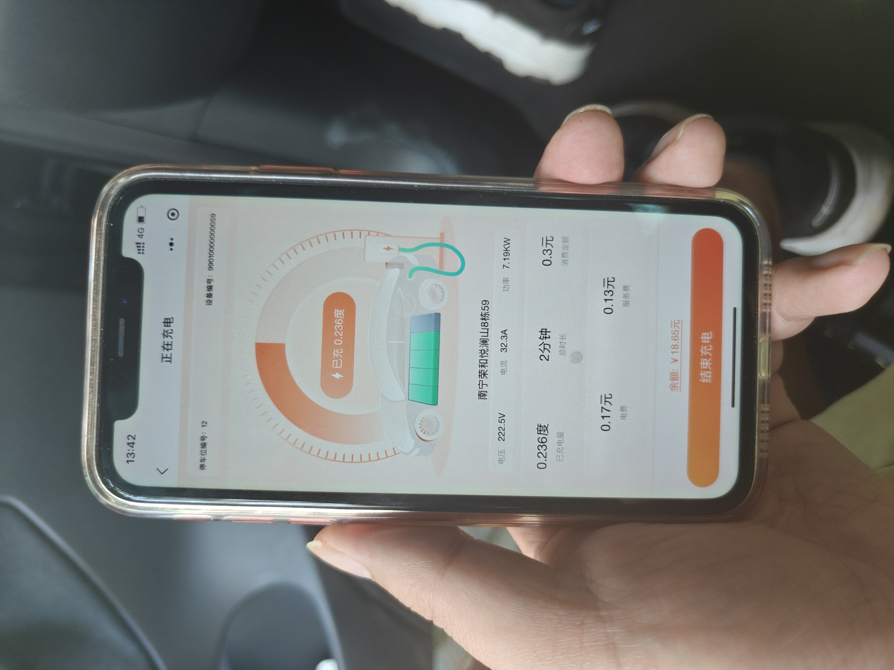

# Recognition Values Review（示例）

> 本文件是格式示例，不是S0009的正式Recognition结果。

## Round

| 字段 | 内容 |
|---|---|
| 采集名称 | 慢充全过程采集 |
| Acquisition Package | `L3-Charge-Slow-FullCycle_慢充全过程采集__20260911_133727_858__S0009` |
| Round | `S0009` |
| Vehicle | `TESLA-M3-SOP5` |
| Review Status | `DRAFT` |
| Reviewer |  |
| Reviewed At |  |

审核方法：保留“AI识别值”和“值位置”不变；人工只修改“人工确认值”“审核状态”和“审核备注”。全部审核完成后，将`Review Status`改为`APPROVED`，再回写`acquisition_context.json`。

## Event E06：记录充电数据1

### Resource E06-P02（图片）

- 文件：`E06-P02_记录充电数据1_20260911_134249_787.jpg`
- 拍摄时间：`2026-09-11 13:42:49.787`
- 图片预览：

| Value ID | 名称 | AI识别值 | 单位 | 值位置 | 人工确认值 | 审核状态 | 审核备注 |
|---|---|---:|---|---|---:|---|---|
| `E06-P02-V01` | 充电电压 | 222.5 | V | 手机画面中部参数行左侧，“电压”后 | 222.5 | `ACCEPTED` | 画面清晰 |
| `E06-P02-V02` | 充电电流 | 32.3 | A | 手机画面中部参数行中央，“电流”后 | 32.3 | `ACCEPTED` | 画面清晰 |
| `E06-P02-V03` | 充电功率 | 7.19 | kW | 手机画面中部参数行右侧，“功率”后 | 7.19 | `ACCEPTED` | 画面清晰 |
| `E06-P02-V04` | 已充电量 | 0.236 | kWh | 手机画面中央圆环内及下方左侧 | 0.236 | `ACCEPTED` | 页面显示单位为“度”，按原义记录为kWh |
| `E06-P02-V05` | 充电时长 | 2 | min | 手机画面下半部第一行中央 | 2 | `ACCEPTED` |  |
| `E06-P02-V06` | 消费金额 | 0.3 | CNY | 手机画面下半部第一行右侧 | 0.3 | `ACCEPTED` |  |
| `E06-P02-V07` | 停车位编号 | 12 |  | 手机画面上部左侧 | 12 | `PENDING` | 请确认是否需要作为现场值保留 |

### Resource E06-N01（Note）

- 来源：Event E06现场备注
- 原文：`桩端显示约7.2千瓦，车辆端显示充电正常。`

| Value ID | 名称 | AI识别值 | 单位 | 值位置 | 人工确认值 | 审核状态 | 审核备注 |
|---|---|---:|---|---|---:|---|---|
| `E06-N01-V01` | 桩端充电功率 | 7.2 | kW | 原文“约7.2千瓦” | 7.2 | `ACCEPTED` | 保留“约”的精度含义 |
| `E06-N01-V02` | 车辆充电状态 | 正常充电 |  | 原文“车辆端显示充电正常” | 正常充电 | `ACCEPTED` | 现场文字观察，不等同于CAN状态 |

### Resource E06-A01（录音转写）

- 文件：`audio/E06-A01.m4a`
- 片段：`00:12.4–00:17.8`
- 转写：`现在桩上是三十二点三安，功率七点一九千瓦。`

| Value ID | 名称 | AI识别值 | 单位 | 值位置 | 人工确认值 | 审核状态 | 审核备注 |
|---|---|---:|---|---|---:|---|---|
| `E06-A01-V01` | 桩端充电电流 | 32.3 | A | 录音`00:13.1–00:14.5`，“三十二点三安” | 32.3 | `ACCEPTED` |  |
| `E06-A01-V02` | 桩端充电功率 | 7.19 | kW | 录音`00:15.0–00:17.2`，“七点一九千瓦” | 7.19 | `CORRECTED` | AI初稿曾误写7.9，人工按语音和图片改为7.19 |

## 审核结论

| 项目 | 内容 |
|---|---|
| 未审核Value | `E06-P02-V07` |
| 来源差异 | Note记录约7.2 kW；图片和录音记录7.19 kW。分别保留，不合并、不平均。 |
| 回写条件 | 所有Value完成审核，Round级`Review Status`改为`APPROVED` |
| JSON回写状态 | `NOT_WRITTEN` |
