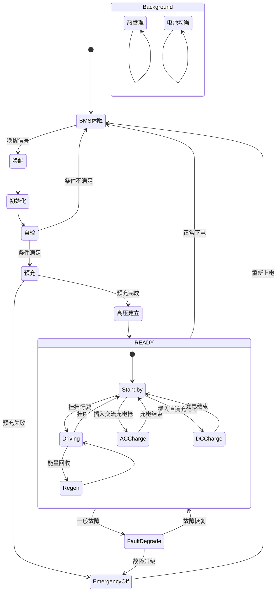
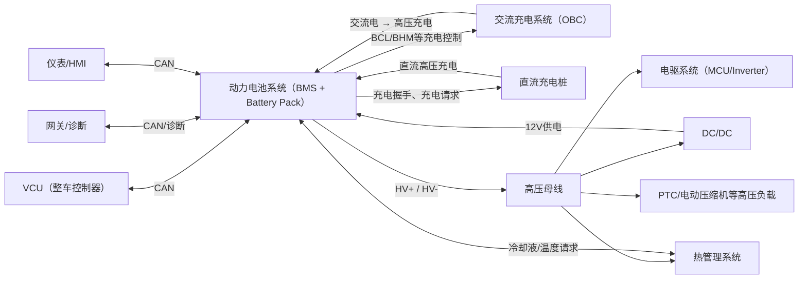

# 动力电池系统

电芯状态决定电池能力，电池能力形成充放电边界，BMS根据安全边界控制高压连接，并将允许能力发送给整车。
# 一、系统结构
```plain text
                           动力电池系统（Battery System）
                                      │
        ┌─────────────────────────────┼─────────────────────────────┐
        │                             │                             │
        ▼                             ▼                             ▼
   ┌───────────┐                ┌─────────────┐              ┌──────────────┐
   │ 电池包PACK │               │  BMS系统     │              │ 电池热管理系统 │
   └─────┬─────┘                └──────┬──────┘              └──────┬───────┘
         │                             ▲                            │
         │                             │                            │
         │                      ┌─────────────┐                     ├── 冷却系统
         │                      │ 采样电路     │                     ├── 加热系统
         │                      └─────────────┘                     ├── 温度监测
         │                                                          └── 泄压/排气系统
         ▼
   ┌───────────┐
   │ 电池模组   │
   └─────┬─────┘
         │
         ▼
   ┌───────────┐
   │  电芯Cell  │
   └─────┬─────┘
         │
         ▼
   ┌───────────┐
   │ 母排Busbar │
   └─────┬─────┘
         │
         ▼
┌──────────────────────────────────────────────┐
│             高压配电单元(HVDU)                 │
├──────────────────────────────────────────────┤
│ 总正(P+)                                      │ 
│ 主熔断器(Main Fuse)                           │
│ 主接触器(Main Contactor)                      │
│ 预充支路(预充接触器 + 预充电阻)                  │
│ 总负(P-)                                      │
└──────────────────────┬───────────────────────┘
                       │
                       ▼
             整车高压系统（MCU / OBC / DCDC 等）
```
<empty-block/>
```plain text
动力电池系统
│
├── 电池包（储能）
├── 高压配电单元（高压通断）
├── 采样电路（数据采集）
├── BMS系统（决策控制）
└── 电池热管理系统（温度控制）
```
- **电池包**：负责储能。
- **高压配电单元**：负责高压建立、预充、安全切断。
- **采样电路**：负责把物理量转换为BMS可处理的数据。
- **BMS系统**：负责状态估算、策略、安全控制。
- **热管理系统**：负责让电池始终工作在合适温度。
<empty-block/>
# 二、状态和变量
## 1、性质分类 
```plain text
一、系统运行状态
BMS休眠、唤醒、初始化、自检、预充、高压建立、
Ready、放电、能量回收、交流充电、直流充电、
均衡、热管理、故障降级、紧急下电。

二、电压变量
单体电压、最高单体电压、最低单体电压、
单体最大压差、模组电压、电池包总电压、
高压母线电压、充电口电压、预充目标电压、
预充实际电压、预充电压差、预充电压比。

三、电流变量
电池包总电流、充电电流、放电电流、
能量回收电流、预充电流、静置电流、
最大允许充电电流、最大允许放电电流。

四、温度变量
电芯或模组温度、最高温度、最低温度、
平均温度、最大温差、冷却液入口温度、
冷却液出口温度、电池包环境温度、
BMS电路板温度、接触器及高压连接器温度。

五、电量与健康变量
SOC、显示SOC、内部SOC、剩余容量、
满充容量、可用能量、SOH、容量SOH、
功率SOH、内阻SOH、电池一致性状态。

六、功率与能力变量
实际充电功率、实际放电功率、最大允许充电功率、
最大允许放电功率、最大允许能量回收功率、
持续功率、峰值功率、功率限制原因。

七、高压与安全变量
绝缘电阻、正极对地绝缘、负极对地绝缘、
HVIL状态、维修开关状态、碰撞状态、
主接触器状态、预充接触器状态、
接触器粘连状态、高压输出允许状态。

八、热失控与环境变量
电池包内部压力、压力变化率、气体检测状态、
烟雾状态、水侵状态、泄压状态、
热失控预警状态。

九、累计与历史变量
累计充电电量、累计放电电量、累计安时、
等效循环次数、快充次数、历史最高温度、
历史最大电流、历史最大压差。
```
## 2、来源分类
  
```plain text
一、直接测量值（Measured）
电压
电流
温度
绝缘
气压
HVIL
接触器反馈
碰撞信号
低压电源

二、估算值（Estimated）
SOC
SOH
剩余容量
可用能量
内阻
电池一致性
循环次数
寿命状态

三、计算限制值（Calculated Limit）
最大允许充电电流
最大允许放电电流
最大允许充电电压
最大允许充电功率
最大允许放电功率
最大允许回收功率
预充目标值
热管理目标值

四、控制状态值（Control State）
BMS运行状态
高压状态
预充状态
充电状态
放电状态
能量回收状态
均衡状态
热管理状态
故障等级
降功率状态
紧急下电状态
```
# 三、主线
## 1、控制主线  
### 1.1、高压建立主线
```plain text
驾驶员上电请求
        │
        ▼
VCU发起上电请求
        │
        ▼
BMS安全检查
        │
        ▼
允许建立高压？
        │
        ├─ 否 ─────► 上电终止
        │
        是
        │
        ▼
执行预充
        │
        ▼
验证母线电压
        │
        ▼
建立高压
        │
        ▼
READY 
```
bms安全检查：HVIL / IMD / SOC / 故障状态 
### 1.2、高压断电控制主线
```plain text
断电条件满足
      │
      ▼
断开主接触器
      │
      ▼
母线放电
      │
      ▼
母线电压降至安全值
      │
      ▼
高压断开完成
```
适用于： 
- 下电
- 碰撞断电
- 急停
### 1.3、热管理控制主线
```plain text
温度采样
      │
      ▼
温度判断
      │
      ▼
发出温控请求
      │
      ▼
等待温度反馈
      │
      ▼
结束温控
```
## 2、能量主线
```plain text
【动力电池PACK】
        │
        ▼
【高压配电单元】
        │
        ▼
【高压母线(HV Bus)】
        │
        ├────────► MCU
        │
        ├────────► DC/DC
        │
        └────────► 其它高压负载(空调、PTC )
```
## 3、保护主线
```plain text
采样监测
    │
    ▼
状态判断
    │
    ▼
安全判定
    │
    ▼
保护策略
    │
    ▼
解除/保持保护
```
状态监测，会做状态判断，比如温度不正常，是不是采样线路失效？              
# 四、控制树
```plain text
动力电池控制
├─ 上电请求  
│  ├─ 安全检查
│  │  ├─ HVIL
│  │  ├─ 绝缘检测
|  |  └─ 上电允许     
│  ├─ 预充执行
│  │  └─ 预充接触器闭合          
│  ├─ 预充电压检查    
│  └─ 高压建立执行 
│     ├─ 主接触器闭合     
│     ├─ 预充接触器断开
│     └─ 高压建立确认
│        ├─ 接触器反馈
│        ├─ 母线电压
│        └─ Ready允许           
│
├─ 高压输出    
│  ├─ 输出能力评估
│  ├   └─最大允许放电功率      
│  ├─ 功率输出响应
│  │   ├─ 功率请求接收
│  │   ├─ 功率限制
│  │   └─ 功率输出            
│  ├─ 过程控制
│  │  ├─ 电池状态持续监测
│  │  ├─ 放电能力循环评估
│  │  ├─ 最大允许放电电流更新
│  │  ├─ 最大允许放电功率更新
│  │  ├─ 放电允许状态更新
│  │  └─ 放电能力输出（→VCU）
│  │
│  ├─ 过程保护
│  │  ├─ 单体欠压监测
│  │  ├─ 单体过压监测
│  │  ├─ 放电过流监测
│  │  ├─ 电池过温/低温监测
│  │  ├─ 绝缘状态监测
│  │  ├─ HVIL状态监测
│  │  ├─ 接触器状态监测
│  │  └─ 状态异常响应
│  │     ├─ 降低允许放电功率
│  │     ├─ 撤销高压输出允许
│  │     ├─ 请求整车撤销扭矩
│  │     └─ 必要时进入故障断电
│  │
│  └─ 高压输出结束
│     ├─ 高压输出请求撤销
│     ├─ 输出电流降至安全阈值
│     └─ 转入断电控制
│   
├─ 断电   
│  ├─ 正常断电请求（VCU请求，锁车，驾驶员OFF，维修模式）
│  │  ├─负载卸载
│  │  ├─电流降至阈值
│  │  ├─断主接触器
|  │  ├─母线放电
│  │  └─休眠             
│  ├─ 一般故障断电请求
│  │  ├─BMS/IMD判断 
│  │  ├─撤销高压输出   
│  │  ├─断主接触器
│  │  ├─故障锁定  
|  │  └─禁止再上电          
│  └─ 严重碰撞断电请求        
│     ├─气囊ECU信号   
│     ├─撤扭矩    
│     ├─断主接触器
│     ├─（必要时）触发烟火断路器
│     ├─高压隔离确认           
|     └─禁止自动恢复   
│
├─ 充电 
│  ├─ 慢充
│  │  ├─ 连接建立  
│  │  ├─ 充电请求（◄─cpECU/OBC）  
│  │  ├─ 电池系统状态评估（soc，soh，温度，单体压差，绝缘，hvil……）
│  │  ├─ 充电能力评估       
│  │  │   └─最大允许电流和功率（─►cpECU/OBC）     
│  │  ├─ 充电使能 （─►cpECU/OBC）
│  │  ├─ 闭合充电接触器/  
│  │  └─ 充电
│  │      ├─ 过程控制
│  │      |  ├─状态监测 
│  │      │  ├─充电能力更新          
│  │      │  |   └─ 充电电压/电流上限（─►cpECU/OBC）
│  │      |  └─持续控制       
|  │      └─ 过程保护   
|  │         └─ 温度、电压、电流等状态检测       
|  │            ├─（如果状态异常）停止充电
|  │            ├─ 保持故障
|  │            └─ 通知cpECU/OBC           
│  ├─ 快充
│  │  ├─ 快充连接及通信建立（↔充电控制器/直流充电桩 ）
│  │  ├─ 快充请求（←cpECU/充电控制器）
│  │  ├─ 电池系统状态评估
│  │  ├─ 快充能力评估
│  │  │  └─ 最大允许电压、电流和功率
│  │  │     （→充电控制器/直流充电桩）
│  │  ├─ 快充允许（→cpECU/充电控制器）
│  │  ├─ 充电前安全检查
│  │  │  ├─ 绝缘检测
│  │  │  ├─ 充电接口状态检查
│  │  │  └─ 充电机输出电压匹配
│  │  ├─ 高压充电回路建立
│  │  │  ├─ 主接触器闭合
│  │  │  └─ 高压回路确认
│  │  ├─ 快充
│  │  │  ├─ 过程控制
│  │  │  │  ├─ 安全充电能力循环评估
│  │  │  │  └─ 充电电压/电流/功率上限更新
│  │  │  │     （→充电控制器/直流充电桩）
│  │  │  └─ 过程保护
│  │  │     ├─ 温度、电压、电流、绝缘等状态监测
│  │  │     └─ 状态异常时停止充电
│  │  │        （→充电控制器/直流充电桩）
│  │  └─ 快充结束
│  │     ├─ 充电电流降至阈值
│  │     ├─ 充电桩停止输出
│  │     ├─ 主接触器断开
│  │     └─ 高压隔离及解锁确认
│  ├─ 动能回收
│  │  ├─ 回收请求（←VCU）
│  │  ├─ 电池系统状态评估
│  │  ├─ 回收充电能力评估
│  │  │  ├─ 最大允许回收电流
│  │  │  ├─ 最大允许回收功率
│  │  │  └─ （→VCU/MCU）
│  │  ├─ 动能回收允许（→VCU）
│  │  ├─ 过程控制
│  │  │  ├─ 状态持续监测
│  │  │  ├─ 回收能力循环评估
│  │  │  └─ 允许电流/功率/更新
│  │  │     （→VCU）
│  │  ├─ 过程保护
│  │  │  ├─ 温度（过温、低温）、单体过压、充电过流等状态监测
│  │  │  └─ 状态异常时限制或退出回收
│  │  └─ 回收结束
│  │     ├─ 撤销发电扭矩
│  │     └─ 回收电流降至零   
│  └─ 被动均衡
│     ├─ 均衡请求
│     │  ├─ 充电状态
│     │  ├─ 静置状态（允许时）
│     │  └─ BMS周期均衡策略
│     │
│     ├─ 均衡条件检查
│     │  ├─ SOC满足条件
│     │  ├─ 单体压差达到阈值
│     │  ├─ 电池温度满足条件
│     │  ├─ 无严重故障
│     │  └─ 均衡允许
│     │
│     ├─ 均衡对象选择
│     │  ├─ 单体电压排序
│     │  ├─ 识别最高电压单体
│     │  └─ 确定均衡电芯
│     │
│     ├─ 被动均衡执行
│     │  ├─ 导通均衡电阻
│     │  ├─ 单体旁路放电
│     │  └─ 均衡电流建立
│     │
│     ├─ 均衡过程控制
│     │  ├─ 单体电压持续监测
│     │  ├─ 单体温度持续监测
│     │  ├─ 均衡压差实时计算
│     │  ├─ 均衡对象动态切换
│     │  └─ 均衡状态输出
│     │
│     ├─ 均衡过程保护
│     │  ├─ 均衡电阻温度监测
│     │  ├─ 单体过温保护
│     │  ├─ 电压异常保护
│     │  ├─ 故障退出均衡
│     │  └─ 充电状态变化退出均衡
│     │
│     └─ 均衡结束
│        ├─ 压差达到目标
│        ├─ 均衡条件失效
│        ├─ 停止均衡放电
│        └─ 均衡完成状态输出  
└─ 热管理
   ├─ 电池系统状态评估
   │  ├─ 电池平均温度
   │  ├─ 最高/最低温度
   │  ├─ 电芯温差
   │  ├─ 环境温度
   │  ├─ SOC状态
   │  ├─ 充放电功率需求
   │  └─ 热管理故障状态
   │
   ├─ 热管理能力评估
   │  ├─ 加热需求评估
   │  ├─ 冷却需求评估
   │  ├─ 保温需求评估
   │  └─ 热管理允许状态
   │
   ├─ 热管理执行
   │  ├─ 电池加热请求
   │  ├─ 电池冷却请求
   │  ├─ 保温请求
   │  └─ 热管理状态输出
   │
   └─ 热管理结束
      ├─ 热管理请求撤销
      └─ 热管理结束状态输出
```
```plain text
慢充控制（细粒度 ）  
```
```plain text
快充控制（细粒度 ） 

├─ 充电
│  ├─ 快充
│  │  ├─ 快充连接确认（←cpECU/充电接口）
│  │  │  ├─ 充电枪连接状态
│  │  │  ├─ 电子锁锁止状态
│  │  │  └─ 低压辅助电源/唤醒确认
│  │  │
│  │  ├─ 通信建立（↔充电控制器/直流充电机）
│  │  │  ├─ 车辆与充电机握手
│  │  │  ├─ 协议及通信状态确认
│  │  │  └─ 电池基本参数发送
│  │  │     ├─ 电池类型
│  │  │     ├─ 额定电压
│  │  │     ├─ 最高允许充电电压
│  │  │     └─ 当前SOC等信息
│  │  │
│  │  ├─ 快充请求（←cpECU/充电控制器）
│  │  │
│  │  ├─ 电池系统状态评估
│  │  │  ├─ 电芯电压状态
│  │  │  ├─ 电池温度状态
│  │  │  ├─ SOC/SOH状态
│  │  │  ├─ HVIL状态
│  │  │  ├─ 绝缘状态
│  │  │  └─ 故障状态
│  │  │
│  │  ├─ 快充能力评估
│  │  │  ├─ 最大允许充电电压
│  │  │  ├─ 最大允许充电电流
│  │  │  └─ 最大允许充电功率
│  │  │     （→充电控制器/直流充电机）
│  │  │
│  │  ├─ 快充允许（→cpECU/充电控制器）
│  │  │
│  │  ├─ 充电前安全检查
│  │  │  ├─ 充电机侧绝缘检测
│  │  │  ├─ 车辆侧绝缘状态确认
│  │  │  ├─ 充电接口温度检查
│  │  │  └─ 充电机输出电压匹配检查
│  │  │
│  │  ├─ 高压充电回路建立
│  │  │  ├─ 充电机预输出/预充
│  │  │  ├─ 充电口电压与电池电压匹配
│  │  │  ├─ 主接触器闭合
│  │  │  └─ 高压回路建立确认
│  │  │     ├─ 接触器反馈确认
│  │  │     └─ 电压、电流反馈确认
│  │  │
│  │  ├─ 快充
│  │  │  ├─ 过程控制
│  │  │  │  ├─ 电池状态持续监测
│  │  │  │  ├─ 安全充电能力循环评估
│  │  │  │  ├─ 充电电压上限更新
│  │  │  │  ├─ 充电电流上限更新
│  │  │  │  └─ 充电功率请求更新
│  │  │  │     （→充电控制器/直流充电机）
│  │  │  │
│  │  │  ├─ 充电阶段控制
│  │  │  │  ├─ 恒流/限流充电
│  │  │  │  ├─ 降流充电
│  │  │  │  └─ 充电末期控制
│  │  │  │
│  │  │  └─ 过程保护
│  │  │     ├─ 单体过压/欠压监测
│  │  │     ├─ 电池过温/低温监测
│  │  │     ├─ 充电过流监测
│  │  │     ├─ 绝缘/HVIL状态监测
│  │  │     ├─ 充电接口温度监测
│  │  │     ├─ 通信状态监测
│  │  │     └─ 状态异常时请求停止充电
│  │  │        （→充电控制器/直流充电机）
│  │  │
│  │  └─ 快充结束
│  │     ├─ 正常结束请求
│  │     │  ├─ 达到目标SOC
│  │     │  ├─ 达到充电截止条件
│  │     │  └─ 用户/充电机结束请求
│  │     ├─ 充电电流降至安全阈值
│  │     ├─ 充电机停止高压输出
│  │     ├─ 主接触器断开
│  │     ├─ 高压隔离确认
│  │     ├─ 充电枪解锁允许
│  │     └─ 充电结束状态输出  
```
快充控制树要重点体现：
**通信建立 → 参数协商 → 绝缘检测 → 电压匹配 → 高压回路建立 → 充电能力循环更新 → 正常/异常停止。**
# 五、实现
```plain text
动力电池系统
├─ BMS
│  ├─ 主控制器（MCU）
│  ├─ 电源管理
│  ├─ 电压采样
│  ├─ 电流采样
│  ├─ 温度采样
│  ├─ 状态估算
│  │  ├─ 总电压计算
│  │  ├─ SOC估算
│  │  ├─ SOH估算
│  │  └─ SOP估算
│  ├─ 接触器驱动
│  ├─ 均衡驱动
│  ├─ 通信接口
│  └─ 存储器
│
├─ 电池包
│  ├─ 电池外壳
│  ├─ 上盖
│  ├─ 密封系统
│  ├─ 高压维修开关（MSD）
│  ├─ 电池模组
│  │  ├─ 电芯
│  │  ├─ 电压采样线
│  │  ├─ 温度传感器
│  │  └─ 模组连接
│  ├─ 电流传感器
│  ├─ 高压连接器
│  └─ 低压连接器
│
├─ 高压配电回路
│  ├─ 主正接触器
│  ├─ 主负接触器
│  ├─ 预充接触器
│  ├─ 预充电阻
│  ├─ 主熔断器（Main Fuse）
│  ├─ 主正母排
│  ├─ 主负母排
│  └─ 高压母线接口
│
├─ 系统接口
│  ├─ 高压接口
│  │  ├─ MCU（电驱）
│  │  ├─ OBC
│  │  ├─ DC/DC
│  │  ├─ 电动压缩机
│  │  ├─ PTC加热器
│  │  ├─ 电池加热器（如有）
│  │  └─ 其它高压负载（根据车型设计）
│  │
│  └─ 低压接口
│     ├─ BMS低压连接器
│     ├─ CAN通信
│     ├─ LIN通信（如有）
│     ├─ 唤醒信号（Wake-up）
│     ├─ 12V供电
│     ├─ 接地（GND）
│     └─ 诊断接口
│
├─ 安全保护
│  ├─ HVIL
│  ├─ IMD（绝缘监测）
│  ├─ 烟火保险（Pyro Fuse，如有）
│  ├─ 碰撞断电回路
│  ├─ 泄压系统
│  │  ├─ 防爆阀
│  │  ├─ 泄压通道
│  │  └─ 排气结构
│  └─ 绝缘防护
│
└─ 热管理系统
   ├─ 冷却板
   ├─ 冷却管路
   ├─ 加热器
   ├─ 温度传感器
   └─ 热管理接口
```
# 六、诊断树
```plain text
动力电池系统故障
│
├── 无法上电
│   │
│   ├── 唤醒失败
│   │      ├── 无上电请求
│   │      └── 通信异常
│   │
│   ├── 初始化失败
│   │      ├── BMS启动失败
│   │      ├── 软件初始化失败
│   │      ├── 采样板通信失败
│   │      └── 通信初始化失败
│   │
│   ├── 自检失败
│   │      ├── HVIL异常
│   │      ├── IMD异常
│   │      ├── SOC过低
│   │      ├── 电压异常
│   │      │      └── 电压采样异常
│   │      ├── 电流异常
│   │      │      └── 电流采样异常
│   │      ├── 温度异常
│   │      │      └── 温度过高/过低
│   │      └── BMS保护禁止上电
│   │
│   ├── 预充失败
│   │      ├── 预充接触器未闭合
│   │      ├── 主接触器未闭合
│   │      ├── 母线电压建立失败
│   │      └── 预充回路故障
│   │
│   └── 高压建立失败
│          ├── 主接触器闭合失败
│          ├── 母线电压异常
│          └── 高压输出异常
│
├── 放电异常
│   ├── 无法驱动车辆
│   ├── 限功率
│   ├── 异常掉电
│   ├── 高压中断
│   └── Ready退出
│
├── 能量回收异常
│   ├── 无法能量回收
│   ├── 回收功率受限
│   └── 回收异常退出
│
├── 无法交流充电
│   ├── 无法建立充电握手
│   ├── 无法启动充电
│   ├── 充电中断
│   └── 充电功率异常
│
├── 无法直流充电
│   ├── 握手失败
│   ├── 无法启动充电
│   ├── 充电中断
│   └── 充电功率异常
│
├── 热管理异常
│   ├── 无法冷却
│   ├── 无法加热
│   ├── 温度控制异常
│   └── 热管理请求失败
│
├── 电池均衡异常
│   ├── 无法进入均衡
│   ├── 均衡中断
│   ├── 单体压差过大
│   └── 均衡效率异常
│
├── 状态估算异常
│   ├── SOC异常
│   ├── SOH异常
│   ├── SOP异常
│   └── 总压估算异常
│
├── 通信异常
│   ├── VCU通信异常
│   ├── OBC通信异常
│   ├── DC充电通信异常
│   ├── 网关通信异常
│   └── 仪表通信异常
│
└── 故障保护异常
    ├── 故障降级
    ├── 紧急下电
    ├── 高压切断
    └── 无法恢复Ready
```
# 七、状态
 

```plain text
状态名称：初始化（Initialization）

主要目的：
完成BMS自身启动，为系统运行做好准备。

主要工作：
• 控制器启动
• 软件运行环境建立
• 外设驱动初始化
• 参数及历史数据加载
• 采样与通信建立

下一状态：
系统自检（Self Check）
```
# 八、边界
```plain text
                     新能源汽车高压系统边界图

                整车控制层
┌──────────────────────────────────────┐
│               VCU                    │
└───────────────┬──────────────────────┘
                │ CAN
                │
┌───────────────┴──────────────────────┐
│               BMS                    │
└───────────────┬──────────────────────┘
                │
    ┌──────┬──────┬──────┬──────┬──────┐
    ▼      ▼      │      │      │      │
 动力电池 采样电路 IMD 热管理 高压配电 充电系统
   PACK                单元

──────────────────────────────────────────────

               高压供电层

        高压配电单元
              │
         高压母线(HV Bus)
              │
     ┌────────┼────────┐
     │        │        │
    MCU     DC/DC   其它HV负载
     │
   驱动电机
```
```plain text
                      电池系统与热管理交互     

动力电池PACK
       │
       │ 温度、电压、电流
       ▼
    采样电路
       │
       ▼
      BMS
       │
       │ 温控请求
       ▼
   热管理系统
       │
       │ 冷却/加热
       ▼
   动力电池PACK
   

动力电池PACK —— 提供状态
采样电路 —— 采集状态
BMS —— 判断状态、制定策略
热管理系统 —— 执行温控策略
PACK —— 温度改变，进入下一轮监测
```

# FAQ
## 1、电芯单体电压
<table header-row="true">
<tr>
<td>项目</td>
<td>磷酸铁锂（LFP）</td>
<td>三元锂（NCM/NCA）</td>
<td>L3重要度</td>
</tr>
<tr>
<td>单体标称电压</td>
<td>约3.2V</td>
<td>约3.6～3.7V</td>
<td>★★★★★</td>
</tr>
<tr>
<td>满充电压</td>
<td>约3.65V</td>
<td>约4.2V（部分4.35V）</td>
<td>★★★★★</td>
</tr>
<tr>
<td>放电截止电压</td>
<td>约2.5～2.8V（车型略有不同）</td>
<td>约2.7～3.0V（车型略有不同）</td>
<td>★★★★☆</td>
</tr>
<tr>
<td>电压平台</td>
<td>平坦</td>
<td>倾斜明显</td>
<td>★★★★★</td>
</tr>
<tr>
<td>SOC估算难度</td>
<td>较高（中段电压变化小）</td>
<td>较低（电压变化较明显）</td>
<td>★★★★☆</td>
</tr>
<tr>
<td>压差敏感性</td>
<td>需要关注</td>
<td>需要关注</td>
<td>★★★★★</td>
</tr>
<tr>
<td>热稳定性</td>
<td>较高</td>
<td>相对较低</td>
<td>★★★★☆</td>
</tr>
</table>
OCV：
静置后的电池电压。
用于SOC校正。
## 2、电芯单体一致性特征指标
<table header-row="true">
<tr>
<td>指标</td>
<td>含义</td>
<td>是否配组重点</td>
<td>L3重要度</td>
</tr>
<tr>
<td>容量（Ah）</td>
<td>能存多少电</td>
<td>★★★★★</td>
<td>★★★★★</td>
</tr>
<tr>
<td>开路电压（OCV）</td>
<td>静置后的电压</td>
<td>★★★★★</td>
<td>★★★★☆</td>
</tr>
<tr>
<td>内阻（DCIR/ACIR）</td>
<td>放电时产生多少压降</td>
<td>★★★★★</td>
<td>★★★★★</td>
</tr>
<tr>
<td>自放电率</td>
<td>放着不用掉电速度</td>
<td>★★★★☆</td>
<td>★★★☆☆</td>
</tr>
</table>
厂家配组看的是"一致性"，一致性主要体现在容量、内阻、OCV和自放电率；维修诊断最容易观察到的是单体电压和压差，它们往往是这些一致性指标在使用过程中的外在表现。
## 3、外部均衡
- 更换模组以后重新配平SOC；
- 怀疑BMS均衡功能异常时，作为维修验证工具；
- 实验室或维修厂需要快速验证，而不想等待车辆完成多次充放电。
外部均衡的典型应用场景
### 1）维修交车（提高维修效率）
<br>目的： 缩短等待BMS自然均衡的时间，尽快恢复单体一致性，完成试车并交付车辆。<br>适用场景：<br>客户急需提车；<br>压差较大，但尚未确认是否为电芯故障。<br>
### 2）更换模组/电芯后的SOC配平
<br>目的： 新旧模组SOC不同，需要统一初始状态，避免装车后立即出现较大压差。<br>适用场景：<br>更换电芯；<br>更换模组；<br>PACK维修后的重新装配。<br>
### 3）诊断验证（L3重点）
<br>目的： 消除SOC差异这一干扰因素，建立统一测试起点，观察压差是否再次出现，从而判断问题来源。<br>验证思路：<br>外部均衡后长期稳定 → 电芯一致性基本正常。<br>外部均衡后迅速再次恶化 → 电芯容量、内阻或自放电异常。<br>外部均衡效果正常，但车辆长期无法自行维持一致性 → 进一步检查BMS均衡策略、均衡电路或电压采样。<br>这是L3诊断中最有价值的应用场景。
（用均衡仪统一soc后，放电看压差，以判断某个电芯是否有问题）<br>
### 4）实验室测试准备
<br>目的： 建立统一SOC初始条件，提高试验效率和数据一致性。<br>适用场景：<br>容量测试；<br>循环寿命试验；<br>性能对比试验；<br>BMS功能验证。<br>一句话总结（建议放在最后）
<br>**外部均衡的本质不是修复电芯，而是快速建立统一SOC基准，为维修、验证和测试创造一致的初始条件。**<br>我建议你以后在L3学习中，把外部均衡定位为三句话：<br>维修阶段：一种辅助维修工具（提高效率）。<br>诊断阶段：一种验证工具（排除SOC干扰）。<br>实验阶段：一种测试准备工具（统一初始条件）。<br>这样，它在整个新能源动力电池体系中的定位就非常清晰了。
<empty-block/>
我反而觉得，这一章节真正应该记住的只有四句话<br>第一<br>压差只是现象，不是故障本身。<br>第二<br>均衡只能统一SOC，不能修复电芯性能。<br>第三<br>均衡后是否再次出现压差，比均衡本身更有诊断价值。<br>第四（也是我认为最重要的一句）<br>诊断的目标不是把压差消掉，而是找出压差产生的原因。
## 4、BMS均衡功能异常识别和诊断
```plain text
① 压差异常
        │
        ▼
② 满充+满足BMS均衡条件
        │
        ├──恢复
        │      ↓
        │   持续观察
        │
        └──未恢复
               │
               ▼
③ 外部均衡
               │
               ▼
④ 建立统一SOC
               │
               ▼
⑤ 行驶观察
      │
      ├──长期稳定
      │       ↓
      │   电芯基本正常
      │
      ├──迅速再次恶化
      │       ↓
      │   电芯问题
      │
      └──恢复缓慢/始终一般
              ↓
      继续检查：
      BMS均衡策略
      ↓
      均衡MOS
      ↓
      均衡电阻
      ↓
      电压采样
```
## 5、soc、soe、sop、soh
```plain text
SOH
│
├──决定：电池总体健康
│
SOC
│
├──决定：还有多少电
│
SOE
│
├──决定：还能释放多少能量
│
SOP
│
└──决定：现在还能释放多大的功率
```
**SOC 看"量"（Quantity）** —— 还剩多少电。
**SOE 看"能"（Energy）** —— 还能提供多少能量。
**SOP 看"力"（Power）** —— 现在还能输出多大功率。
**SOH 看"寿命"（Health）** —— 电池整体健康程度。
<empty-block/>
## 6、热失控
 
```plain text
制造缺陷
      │
机械损伤
      │
锂枝晶
      │
老化
      │
内部微短路
      │
──────────────
（BMS很多时候看不到）
──────────────
      │
局部发热
      │
温度开始扩散
      │
BMS开始发现异常
      │
限制功率
      │
断高压
      │
如果仍继续升温
      │
进入热失控
      │
热蔓延
```
<empty-block/>
<page url="https://app.notion.com/p/3a8a4e43864980e89a7bf5dede408127">动力电池状态变量表  </page>

