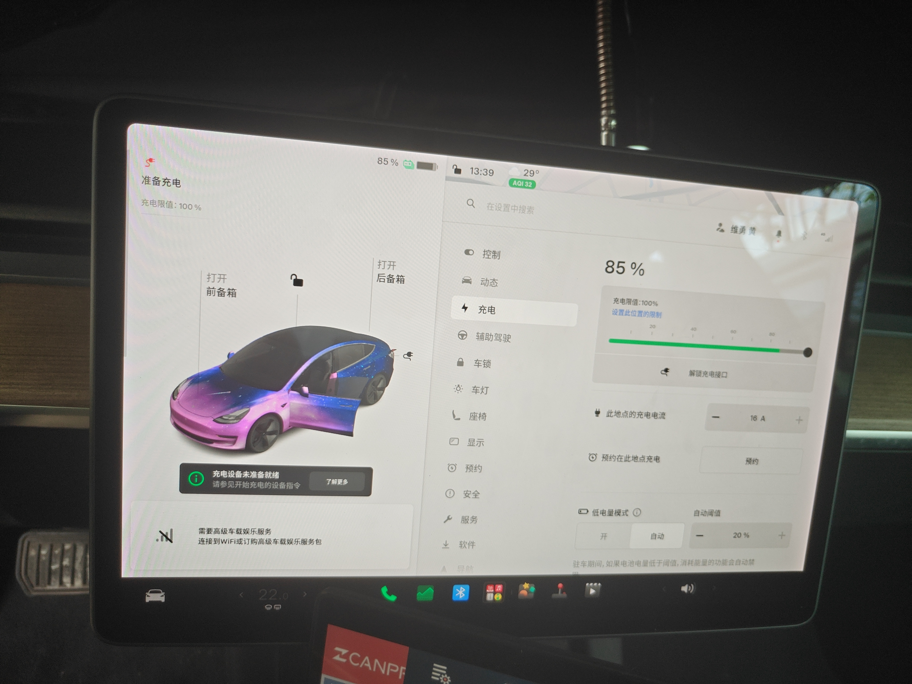
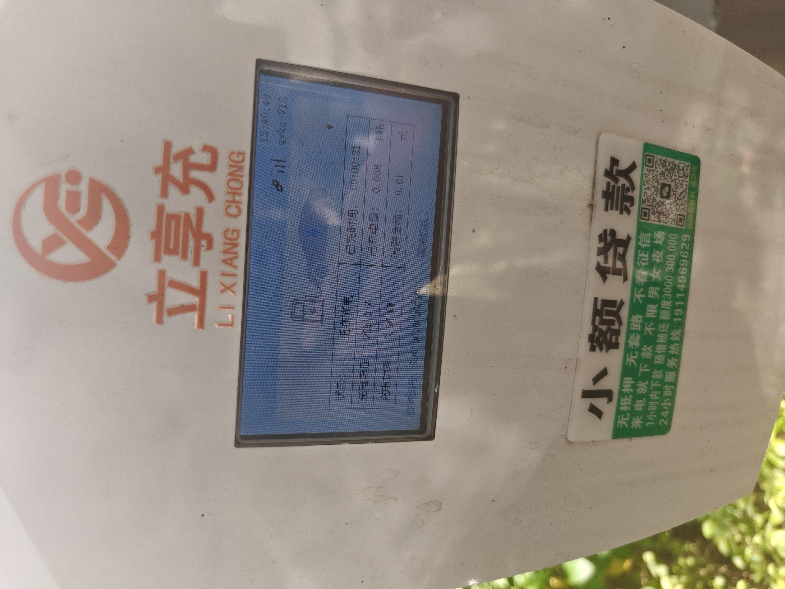
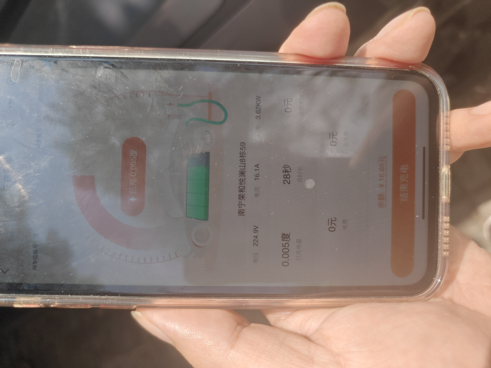
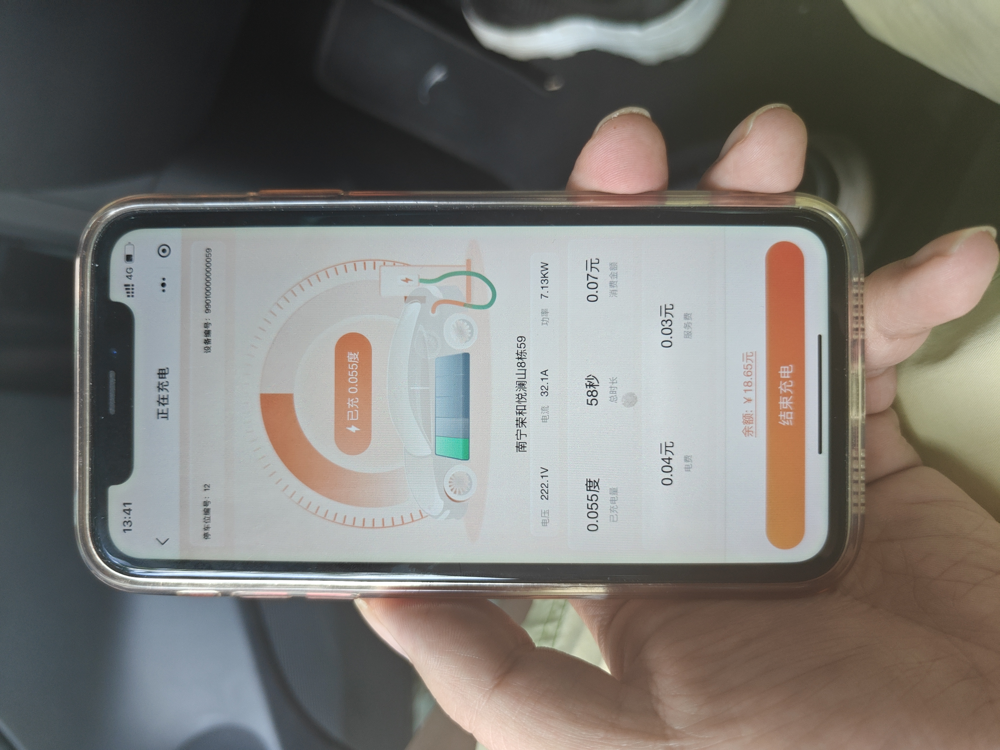
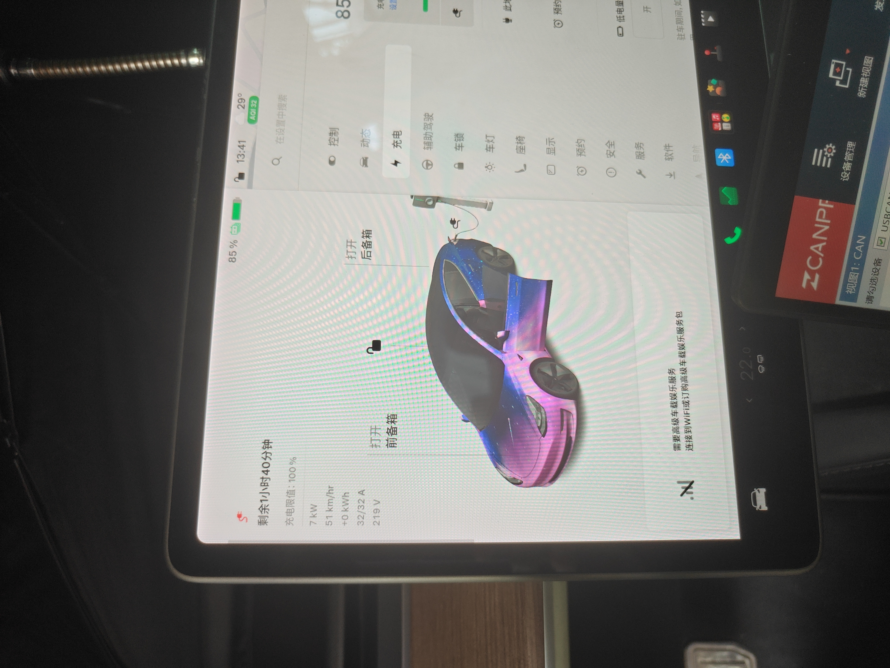
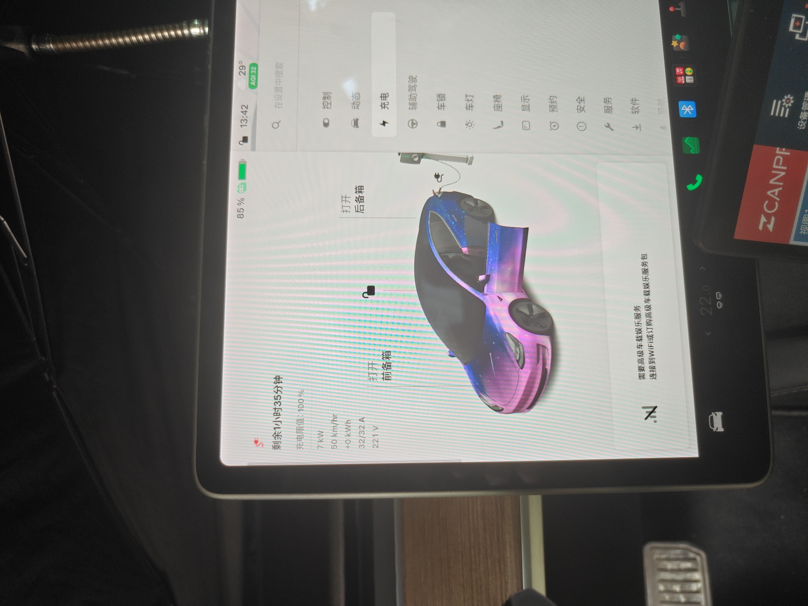
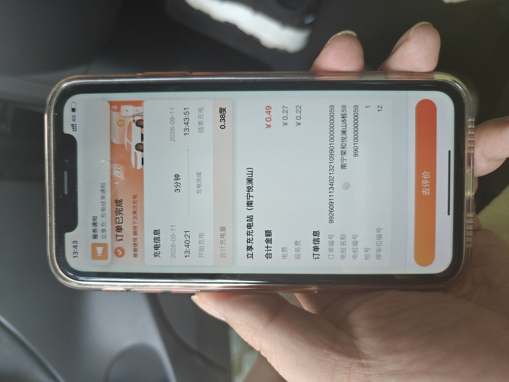
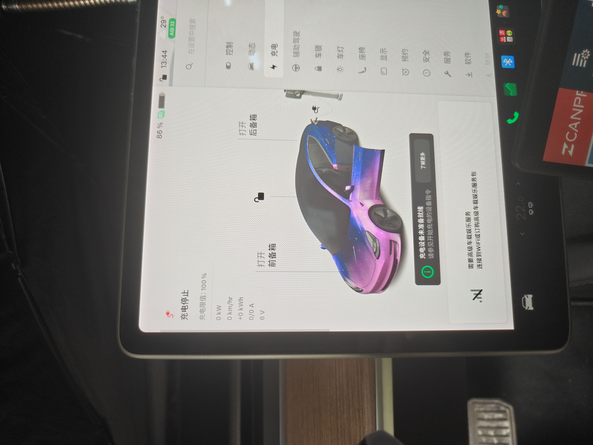

# Recognition Values Review

<!-- ACQUISITION_CONTEXT_REVIEW_V1 -->

## Round

| 字段 | 内容 |
|---|---|
| 采集名称 | 慢充全过程采集 |
| Acquisition Package | `L3-Charge-Slow-FullCycle_慢充全过程采集__20260911_133727_858__S0009` |
| Round | `S0009` |
| Vehicle | `TESLA-M3-SOP5` |
| Validation | `PASS` |
| Review Status | `APPROVED` |
| Reviewer | 用户人工审核 |
| Reviewed At | 2026-09-11 |

保留AI识别值和值位置；人工修改确认值、审核状态和审核备注。全部完成后将Review Status改为`APPROVED`。

## Event E01：开始采集

<!-- EVENT:E01 -->

- 实际时间：`2026-09-11T13:37:27.926+08:00`
- 状态：`triggered`

## Event E02：开充电小门

<!-- EVENT:E02 -->

- 实际时间：`2026-09-11T13:38:07.899+08:00`
- 状态：`triggered`

## Event E03：插枪

<!-- EVENT:E03 -->

- 实际时间：`2026-09-11T13:38:27.895+08:00`
- 状态：`triggered`

### Resource E03-P01（PHOTO）

<!-- RESOURCE:E03-P01 -->

- 文件：`photos/E03-P01_插枪_20260911_133907_626.jpg`
- 拍摄时间：`2026-09-11T13:39:07.626+08:00`
- 图片预览：

| Value ID | 名称 | AI识别值 | 单位 | 值位置 | 人工确认值 | 审核状态 | 审核备注 |
|---|---|---|---|---|---|---|---|
| E03-P01-V01 | 车辆充电状态 | 准备充电 |  | 车机左侧充电面板顶部 | 准备充电 | ACCEPTED |  |
| E03-P01-V02 | SOC | 85 | % | 车机顶部状态栏及右侧电池卡片 | 85 | ACCEPTED |  |
| E03-P01-V03 | 充电限值 | 100 | % | 车机左侧充电面板 | 100 | ACCEPTED |  |
| E03-P01-V04 | 充电电流设置 | 16 | A | 车机右侧充电设置中的此地点的充电电流 | 16 | ACCEPTED |  |
| E03-P01-V05 | 车辆提示 | 充电设备未准备就绪 |  | 车机车辆图下方提示条 | 充电设备未准备就绪 | ACCEPTED |  |

## Event E04：记录连接状态

<!-- EVENT:E04 -->

- 实际时间：`2026-09-11T13:39:07.919+08:00`
- 状态：`triggered`

## Event E05：扫码启动

<!-- EVENT:E05 -->

- 实际时间：`2026-09-11T13:40:07.880+08:00`
- 状态：`triggered`

### Resource E05-P01（PHOTO）

<!-- RESOURCE:E05-P01 -->

- 文件：`photos/E05-P01_扫码启动_20260911_134042_388.jpg`
- 拍摄时间：`2026-09-11T13:40:42.388+08:00`
- 图片预览：

| Value ID | 名称 | AI识别值 | 单位 | 值位置 | 人工确认值 | 审核状态 | 审核备注 |
|---|---|---|---|---|---|---|---|
| E05-P01-V01 | 桩端充电状态 | 正在充电 |  | 充电桩屏幕表格左上 | 正在充电 | ACCEPTED |  |
| E05-P01-V02 | 桩端已充时间 | 00:00:21 |  | 充电桩屏幕表格右上 | 00:00:21 | ACCEPTED |  |
| E05-P01-V03 | 桩端充电电压 | 225.0 | V | 充电桩屏幕表格左中 | 225.0 | ACCEPTED |  |
| E05-P01-V04 | 桩端充电功率 | 3.66 | kW | 充电桩屏幕表格左下 | 3.66 | ACCEPTED |  |
| E05-P01-V05 | 桩端已充电量 | 0.008 | kWh | 充电桩屏幕表格右中 | 0.008 | ACCEPTED |  |
| E05-P01-V06 | 桩端消费金额 | 0.01 | CNY | 充电桩屏幕表格右下 | 0.01 | ACCEPTED |  |

### Resource E05-P02（PHOTO）

<!-- RESOURCE:E05-P02 -->

- 文件：`photos/E05-P02_扫码启动_20260911_134050_424.jpg`
- 拍摄时间：`2026-09-11T13:40:50.424+08:00`
- 图片预览：

| Value ID | 名称 | AI识别值 | 单位 | 值位置 | 人工确认值 | 审核状态 | 审核备注 |
|---|---|---|---|---|---|---|---|
| E05-P02-V01 | 小程序充电电压 | 224.9 | V | 手机画面中部参数行左侧 | 224.9 | ACCEPTED |  |
| E05-P02-V02 | 小程序充电电流 | 16.1 | A | 手机画面中部参数行中央 | 16.1 | ACCEPTED |  |
| E05-P02-V03 | 小程序充电功率 | 3.62 | kW | 手机画面中部参数行右侧 | 3.62 | ACCEPTED |  |
| E05-P02-V04 | 小程序已充电量 | 0.005 | kWh | 手机画面中央圆环内及下方左侧 | 0.005 | ACCEPTED |  |
| E05-P02-V05 | 小程序充电时长 | 28 | s | 手机画面下半部第一行中央 | 28 | ACCEPTED |  |
| E05-P02-V06 | 小程序消费金额 | 0 | CNY | 手机画面下半部第一行右侧 | 0 | ACCEPTED |  |
| E05-P02-V07 | 停车位编号 | 12 |  | 手机画面上部左侧 | 12 | ACCEPTED |  |

### Resource E05-P03（PHOTO）

<!-- RESOURCE:E05-P03 -->

- 文件：`photos/E05-P03_扫码启动_20260911_134127_933.jpg`
- 拍摄时间：`2026-09-11T13:41:27.933+08:00`
- 图片预览：

| Value ID | 名称 | AI识别值 | 单位 | 值位置 | 人工确认值 | 审核状态 | 审核备注 |
|---|---|---|---|---|---|---|---|
| E05-P03-V01 | 小程序充电电压 | 222.1 | V | 手机画面中部参数行左侧 | 222.1 | ACCEPTED |  |
| E05-P03-V02 | 小程序充电电流 | 32.1 | A | 手机画面中部参数行中央 | 32.1 | ACCEPTED |  |
| E05-P03-V03 | 小程序充电功率 | 7.13 | kW | 手机画面中部参数行右侧 | 7.13 | ACCEPTED |  |
| E05-P03-V04 | 小程序已充电量 | 0.055 | kWh | 手机画面中央圆环内及下方左侧 | 0.055 | ACCEPTED |  |
| E05-P03-V05 | 小程序充电时长 | 58 | s | 手机画面下半部第一行中央 | 58 | ACCEPTED |  |
| E05-P03-V06 | 小程序消费金额 | 0.07 | CNY | 手机画面下半部第一行右侧 | 0.07 | ACCEPTED |  |
| E05-P03-V07 | 小程序电费 | 0.04 | CNY | 手机画面下半部第二行左侧 | 0.04 | ACCEPTED |  |
| E05-P03-V08 | 小程序服务费 | 0.03 | CNY | 手机画面下半部第二行右侧 | 0.03 | ACCEPTED |  |

## Event E06：记录充电数据1

<!-- EVENT:E06 -->

- 实际时间：`2026-09-11T13:41:27.954+08:00`
- 状态：`triggered`

### Resource E06-P01（PHOTO）

<!-- RESOURCE:E06-P01 -->

- 文件：`photos/E06-P01_记录充电数据1_20260911_134133_171.jpg`
- 拍摄时间：`2026-09-11T13:41:33.171+08:00`
- 图片预览：

| Value ID | 名称 | AI识别值 | 单位 | 值位置 | 人工确认值 | 审核状态 | 审核备注 |
|---|---|---|---|---|---|---|---|
| E06-P01-V01 | 车辆充电状态 | 正在充电 |  | 车机左侧充电面板 | 正在充电 | ACCEPTED |  |
| E06-P01-V02 | SOC | 85 | % | 车机顶部状态栏 | 85 | ACCEPTED |  |
| E06-P01-V03 | 预计剩余时间 | 1小时40分钟 |  | 车机左侧充电面板顶部 | 1小时40分钟 | ACCEPTED |  |
| E06-P01-V04 | 车辆显示充电功率 | 7 | kW | 车机左侧充电参数列 | 7 | ACCEPTED |  |
| E06-P01-V05 | 车辆显示充电速度 | 51 | km/h | 车机左侧充电参数列 | 51 | ACCEPTED |  |
| E06-P01-V06 | 车辆显示充电电流 | 32/32 | A | 车机左侧充电参数列 |  | REJECTED | 原始复合显示不直接供Analysis使用；拆分为限额和实际电流 |
| E06-P01-V06-LIMIT | 车辆充电电流限额 |  | A | 原始显示“32/32 A” | 32 | HUMAN_ADDED | 用户人工确认 |
| E06-P01-V06-ACTUAL | 车辆实际充电电流 |  | A | 原始显示“32/32 A” | 32 | HUMAN_ADDED | 用户人工确认 |
| E06-P01-V07 | 车辆显示充电电压 | 219 | V | 车机左侧充电参数列 | 219 | ACCEPTED |  |

### Resource E06-P02（PHOTO）

<!-- RESOURCE:E06-P02 -->

- 文件：`photos/E06-P02_记录充电数据1_20260911_134249_787.jpg`
- 拍摄时间：`2026-09-11T13:42:49.787+08:00`
- 图片预览：

| Value ID | 名称 | AI识别值 | 单位 | 值位置 | 人工确认值 | 审核状态 | 审核备注 |
|---|---|---|---|---|---|---|---|
| E06-P02-V01 | 小程序充电电压 | 222.5 | V | 手机画面中部参数行左侧 | 222.5 | ACCEPTED |  |
| E06-P02-V02 | 小程序充电电流 | 32.3 | A | 手机画面中部参数行中央 | 32.3 | ACCEPTED |  |
| E06-P02-V03 | 小程序充电功率 | 7.19 | kW | 手机画面中部参数行右侧 | 7.19 | ACCEPTED |  |
| E06-P02-V04 | 小程序已充电量 | 0.236 | kWh | 手机画面中央圆环内及下方左侧 | 0.236 | ACCEPTED |  |
| E06-P02-V05 | 小程序充电时长 | 2 | min | 手机画面下半部第一行中央 | 2 | ACCEPTED |  |
| E06-P02-V06 | 小程序消费金额 | 0.3 | CNY | 手机画面下半部第一行右侧 | 0.3 | ACCEPTED |  |
| E06-P02-V07 | 小程序电费 | 0.17 | CNY | 手机画面下半部第二行左侧 | 0.17 | ACCEPTED |  |
| E06-P02-V08 | 小程序服务费 | 0.13 | CNY | 手机画面下半部第二行右侧 | 0.13 | ACCEPTED |  |

## Event E07：记录充电数据2

<!-- EVENT:E07 -->

- 实际时间：`2026-09-11T13:42:47.931+08:00`
- 状态：`triggered`

### Resource E07-P01（PHOTO）

<!-- RESOURCE:E07-P01 -->

- 文件：`photos/E07-P01_记录充电数据2_20260911_134255_656.jpg`
- 拍摄时间：`2026-09-11T13:42:55.656+08:00`
- 图片预览：

| Value ID | 名称 | AI识别值 | 单位 | 值位置 | 人工确认值 | 审核状态 | 审核备注 |
|---|---|---|---|---|---|---|---|
| E07-P01-V01 | 车辆充电状态 | 正在充电 |  | 车机左侧充电面板 | 正在充电 | ACCEPTED |  |
| E07-P01-V02 | SOC | 85 | % | 车机顶部状态栏 | 85 | ACCEPTED |  |
| E07-P01-V03 | 预计剩余时间 | 1小时35分钟 |  | 车机左侧充电面板顶部 | 1小时35分钟 | ACCEPTED |  |
| E07-P01-V04 | 车辆显示充电功率 | 7 | kW | 车机左侧充电参数列 | 7 | ACCEPTED |  |
| E07-P01-V05 | 车辆显示充电速度 | 50 | km/h | 车机左侧充电参数列 | 50 | ACCEPTED |  |
| E07-P01-V06 | 车辆显示充电电流 | 32/32 | A | 车机左侧充电参数列 |  | REJECTED | 原始复合显示不直接供Analysis使用；拆分为限额和实际电流 |
| E07-P01-V06-LIMIT | 车辆充电电流限额 |  | A | 原始显示“32/32 A” | 32 | HUMAN_ADDED | 用户人工确认 |
| E07-P01-V06-ACTUAL | 车辆实际充电电流 |  | A | 原始显示“32/32 A” | 32 | HUMAN_ADDED | 用户人工确认 |
| E07-P01-V07 | 车辆显示充电电压 | 221 | V | 车机左侧充电参数列 | 221 | ACCEPTED |  |

## Event E08：停止充电

<!-- EVENT:E08 -->

- 实际时间：`2026-09-11T13:43:47.960+08:00`
- 状态：`triggered`

### Resource E08-P01（PHOTO）

<!-- RESOURCE:E08-P01 -->

- 文件：`photos/E08-P01_停止充电_20260911_134356_019.jpg`
- 拍摄时间：`2026-09-11T13:43:56.019+08:00`
- 图片预览：

| Value ID | 名称 | AI识别值 | 单位 | 值位置 | 人工确认值 | 审核状态 | 审核备注 |
|---|---|---|---|---|---|---|---|
| E08-P01-V01 | 订单状态 | 订单已完成 |  | 手机画面顶部 | 订单已完成 | ACCEPTED |  |
| E08-P01-V02 | 订单开始时间 | 2026-09-11 13:40:21 |  | 手机画面充电信息左侧 | 2026-09-11 13:40:21 | ACCEPTED |  |
| E08-P01-V03 | 订单结束时间 | 2026-09-11 13:43:51 |  | 手机画面充电信息右侧 | 2026-09-11 13:43:51 | ACCEPTED |  |
| E08-P01-V04 | 订单显示时长 | 3 | min | 手机画面充电信息中央 | 3 | ACCEPTED |  |
| E08-P01-V05 | 合计充电量 | 0.38 | kWh | 手机画面充电信息下方 | 0.38 | ACCEPTED |  |
| E08-P01-V06 | 合计金额 | 0.49 | CNY | 手机画面费用区域右侧 | 0.49 | ACCEPTED |  |
| E08-P01-V07 | 电费 | 0.27 | CNY | 手机画面费用区域电费行 | 0.27 | ACCEPTED |  |
| E08-P01-V08 | 服务费 | 0.22 | CNY | 手机画面费用区域服务费行 | 0.22 | ACCEPTED |  |
| E08-P01-V09 | 充电枪号 | 1 |  | 手机画面订单信息枪号行 | 1 | ACCEPTED |  |
| E08-P01-V10 | 停车位编号 | 12 |  | 手机画面订单信息底部 | 12 | ACCEPTED |  |

### Resource E08-P02（PHOTO）

<!-- RESOURCE:E08-P02 -->

- 文件：`photos/E08-P02_停止充电_20260911_134401_541.jpg`
- 拍摄时间：`2026-09-11T13:44:01.541+08:00`
- 图片预览：

| Value ID | 名称 | AI识别值 | 单位 | 值位置 | 人工确认值 | 审核状态 | 审核备注 |
|---|---|---|---|---|---|---|---|
| E08-P02-V01 | 车辆充电状态 | 充电停止 |  | 车机左侧充电面板顶部 | 充电停止 | ACCEPTED |  |
| E08-P02-V02 | SOC | 86 | % | 车机顶部状态栏 | 86 | ACCEPTED |  |
| E08-P02-V03 | 车辆显示充电功率 | 0 | kW | 车机左侧充电参数列 | 0 | ACCEPTED |  |
| E08-P02-V04 | 车辆显示充电速度 | 0 | km/h | 车机左侧充电参数列 | 0 | ACCEPTED |  |
| E08-P02-V05 | 车辆显示充电电流 | 0/0 | A | 车机左侧充电参数列 | 0/0 | ACCEPTED |  |
| E08-P02-V06 | 车辆显示充电电压 | 6 | V | 车机左侧充电参数列 | 6 | ACCEPTED |  |
| E08-P02-V07 | 车辆提示 | 充电设备未准备就绪 |  | 车机车辆图下方提示条 | 充电设备未准备就绪 | ACCEPTED |  |

## Event E09：解锁充电枪

<!-- EVENT:E09 -->

- 实际时间：`2026-09-11T13:44:47.913+08:00`
- 状态：`triggered`

## Event E10：拔枪

<!-- EVENT:E10 -->

- 实际时间：`2026-09-11T13:45:17.961+08:00`
- 状态：`triggered`

## Event E11：结束采集

<!-- EVENT:E11 -->

- 实际时间：`2026-09-11T13:46:27.956+08:00`
- 状态：`triggered`
