# Recognition Values Review

<!-- ACQUISITION_CONTEXT_REVIEW_V1 -->

## Round

| 字段 | 内容 |
|---|---|
| 采集名称 | 语音执行脚本 |
| Acquisition Package | `TM3-017_语音执行脚本__20260915_190425_266__S0030` |
| Round | `S0030` |
| Vehicle | `TESLA-M3-SOP5` |
| Validation | `PASS` |
| Review Status | `APPROVED` |
| Reviewer | 用户 |
| Reviewed At | 2026-09-15 |

保留AI识别值和值位置；人工修改确认值、审核状态和审核备注。全部完成后将Review Status改为`APPROVED`。

### Recognition边界说明

- E01是采集开始并保持既有32 A稳定充电状态，不是控制动作；E02是该初始状态的记录Event。
- E01至E02之间没有计划控制输入，也没有现场异常或额外操作记录。不得要求ASC证明不存在未记录的人工动作。
- `E01-P01`保留VoiceRunner原始`event_id = E01`关联，不改写历史记录；照片实际拍摄时间为`2026-09-15T19:04:59.854+08:00`，即E02实际时间后4.535秒。
- 该4.535秒差异只影响照片的实际时间锚点。照片内容按其实际拍摄时间用于同一初始32 A阶段的Recognition，不将E01至E02重新定义为待ASC证明是否存在控制状态变化。
- ASC后续只用于确认该阶段的实际响应及由程序计算稳定窗口；不用于反推人工控制动作。计划Event时间、照片时间和CAN观察时间继续分别保留。

## Event E01：开始采集并保持充电

<!-- EVENT:E01 -->

- 实际时间：`2026-09-15T19:04:25.302+08:00`
- 状态：`triggered`

### Resource E01-P01（PHOTO）

<!-- RESOURCE:E01-P01 -->

- 文件：`photos/E01-P01_开始采集并保持充电_20260915_190459_854.jpg`
- 拍摄时间：`2026-09-15T19:04:59.854+08:00`
- 图片预览：

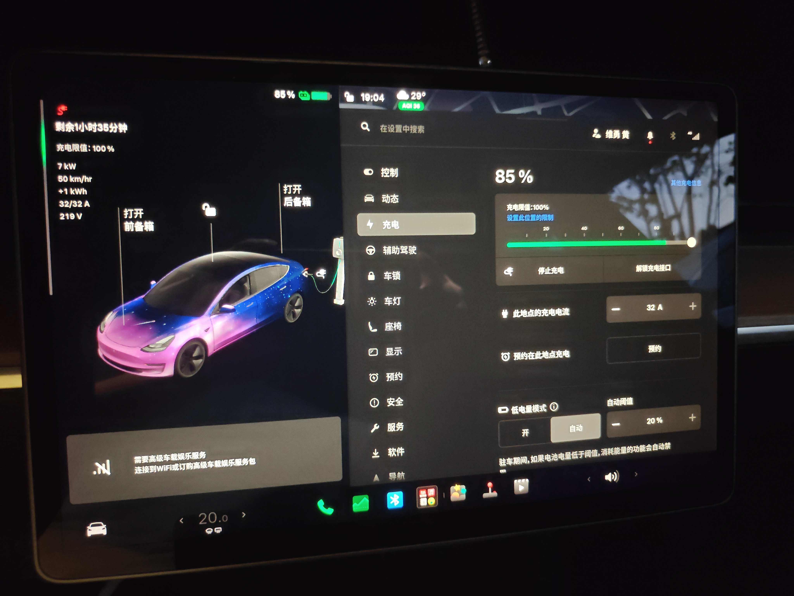

| Value ID | 名称 | AI识别值 | 单位 | 值位置 | 人工确认值 | 审核状态 | 审核备注 |
|---|---|---|---|---|---|---|---|
| E01-P01-V01 | 车辆充电状态 | 正在充电 |  | 车机充电页面左侧状态区 | 正在充电 | ACCEPTED |  |
| E01-P01-V02 | SOC | 85 | % | 车机页面顶部电池状态 | 85 | ACCEPTED |  |
| E01-P01-V03 | 车辆显示充电电压 | 219 | V | 车机充电页面左侧参数列 | 219 | ACCEPTED |  |
| E01-P01-V04 | 车辆实际充电电流 | 32 | A | 车机充电页面左侧参数列 | 32 | ACCEPTED |  |
| E01-P01-V05 | 车辆充电电流可用上限 | 32 | A | 车机充电页面左侧参数列 | 32 | ACCEPTED |  |
| E01-P01-V06 | 车辆显示充电功率 | 7 | kW | 车机充电页面左侧参数列 | 7 | ACCEPTED |  |
| E01-P01-V07 | 车辆充电电流设置 | 32 | A | 车机充电设置右侧调节栏 | 32 | ACCEPTED | 照片原始关联为E01；实际拍摄于E02后4.535秒，作为同一初始32 A阶段的实际时间锚点 |

## Event E02：记录32安初始状态

<!-- EVENT:E02 -->

- 实际时间：`2026-09-15T19:04:55.319+08:00`
- 状态：`triggered`

## Event E03：调低到16安并记录

<!-- EVENT:E03 -->

- 实际时间：`2026-09-15T19:05:45.322+08:00`
- 状态：`triggered`

### Resource E03-P01（PHOTO）

<!-- RESOURCE:E03-P01 -->

- 文件：`photos/E03-P01_调低到16安并记录_20260915_190557_763.jpg`
- 拍摄时间：`2026-09-15T19:05:57.763+08:00`
- 图片预览：

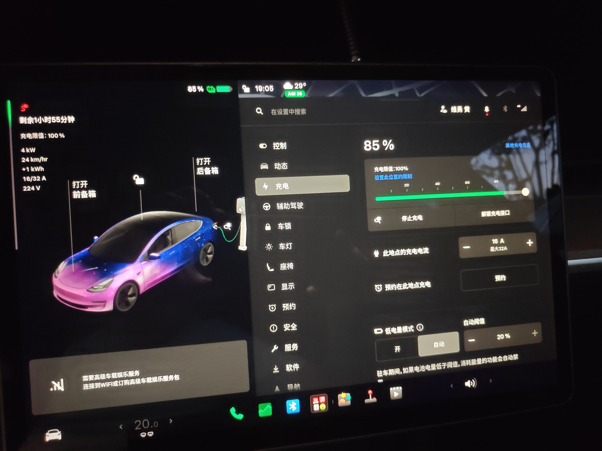

| Value ID | 名称 | AI识别值 | 单位 | 值位置 | 人工确认值 | 审核状态 | 审核备注 |
|---|---|---|---|---|---|---|---|
| E03-P01-V01 | 车辆充电状态 | 正在充电 |  | 车机充电页面左侧状态区 | 正在充电 | ACCEPTED |  |
| E03-P01-V02 | SOC | 85 | % | 车机页面顶部电池状态 | 85 | ACCEPTED |  |
| E03-P01-V03 | 车辆显示充电电压 | 224 | V | 车机充电页面左侧参数列 | 224 | ACCEPTED |  |
| E03-P01-V04 | 车辆实际充电电流 | 16 | A | 车机充电页面左侧参数列 | 16 | ACCEPTED |  |
| E03-P01-V05 | 车辆充电电流可用上限 | 32 | A | 车机充电页面左侧参数列 | 32 | ACCEPTED |  |
| E03-P01-V06 | 车辆显示充电功率 | 4 | kW | 车机充电页面左侧参数列 | 4 | ACCEPTED |  |
| E03-P01-V07 | 车辆充电电流设置 | 16 | A | 车机充电设置右侧调节栏 | 16 | ACCEPTED |  |

### Resource E03-P02（PHOTO）

<!-- RESOURCE:E03-P02 -->

- 文件：`photos/E03-P02_调低到16安并记录_20260915_190606_464.jpg`
- 拍摄时间：`2026-09-15T19:06:06.464+08:00`
- 图片预览：

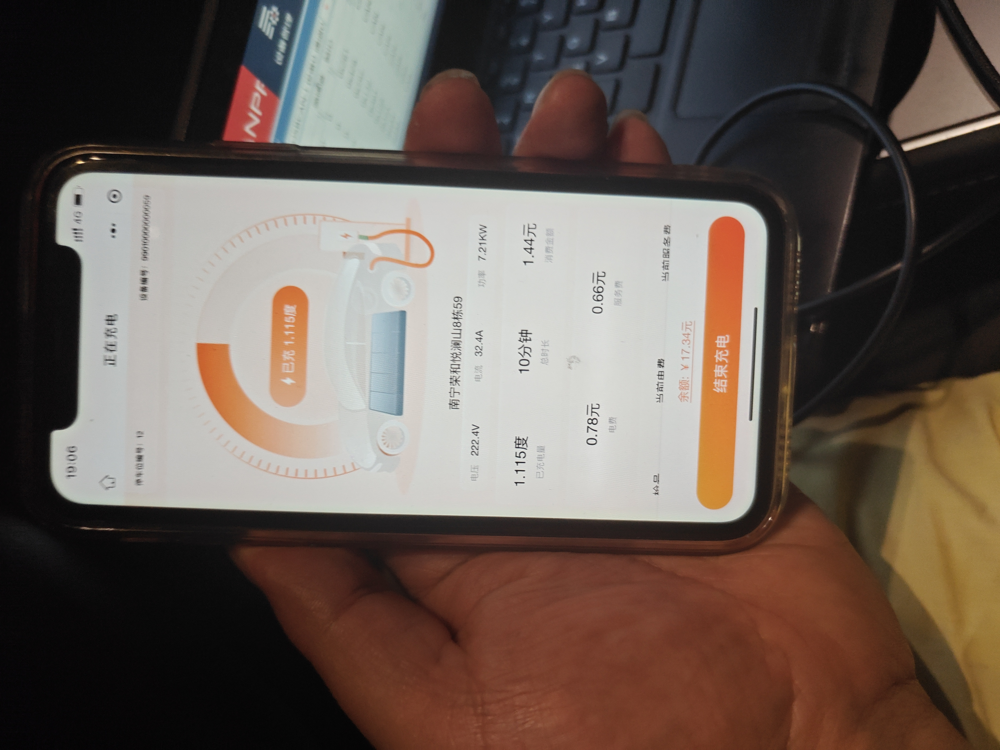

| Value ID | 名称 | AI识别值 | 单位 | 值位置 | 人工确认值 | 审核状态 | 审核备注 |
|---|---|---|---|---|---|---|---|
| E03-P02-V01 | 配套应用充电状态 | 正在充电 |  | 手机页面顶部 | 正在充电 | ACCEPTED |  |
| E03-P02-V02 | 配套应用交流电压 | 222.4 | V | 手机页面参数行左侧 | 222.4 | ACCEPTED |  |
| E03-P02-V03 | 配套应用交流电流 | 32.4 | A | 手机页面参数行中部 | 32.4 | ACCEPTED | 拍摄于调低Event后21.142秒；页面仍显示高电流，实时性及响应延迟待结合后续Evidence解释 |
| E03-P02-V04 | 配套应用充电功率 | 7.21 | kW | 手机页面参数行右侧 | 7.21 | ACCEPTED |  |

## Event E04：确认16安设置保持

<!-- EVENT:E04 -->

- 实际时间：`2026-09-15T19:06:10.266+08:00`
- 状态：`triggered`

### Resource E04-P01（PHOTO）

<!-- RESOURCE:E04-P01 -->

- 文件：`photos/E04-P01_确认16安设置保持_20260915_190617_823.jpg`
- 拍摄时间：`2026-09-15T19:06:17.823+08:00`
- 图片预览：

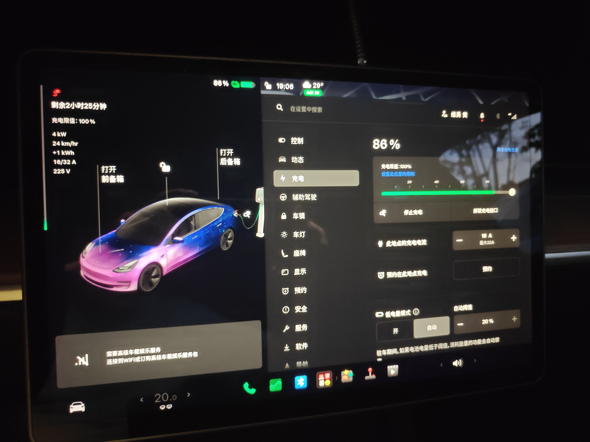

| Value ID | 名称 | AI识别值 | 单位 | 值位置 | 人工确认值 | 审核状态 | 审核备注 |
|---|---|---|---|---|---|---|---|
| E04-P01-V01 | 车辆充电状态 | 正在充电 |  | 车机充电页面左侧状态区 | 正在充电 | ACCEPTED |  |
| E04-P01-V02 | SOC | 86 | % | 车机页面顶部电池状态 | 86 | ACCEPTED |  |
| E04-P01-V03 | 车辆显示充电电压 | 225 | V | 车机充电页面左侧参数列 | 225 | ACCEPTED |  |
| E04-P01-V04 | 车辆实际充电电流 | 16 | A | 车机充电页面左侧参数列 | 16 | ACCEPTED |  |
| E04-P01-V05 | 车辆充电电流可用上限 | 32 | A | 车机充电页面左侧参数列 | 32 | ACCEPTED |  |
| E04-P01-V06 | 车辆显示充电功率 | 4 | kW | 车机充电页面左侧参数列 | 4 | ACCEPTED |  |
| E04-P01-V07 | 车辆充电电流设置 | 16 | A | 车机充电设置右侧调节栏 | 16 | ACCEPTED |  |

### Resource E04-P02（PHOTO）

<!-- RESOURCE:E04-P02 -->

- 文件：`photos/E04-P02_确认16安设置保持_20260915_190626_553.jpg`
- 拍摄时间：`2026-09-15T19:06:26.553+08:00`
- 图片预览：

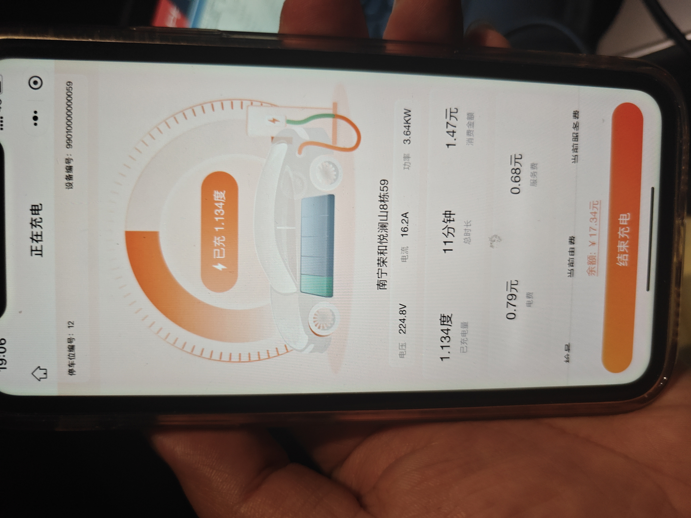

| Value ID | 名称 | AI识别值 | 单位 | 值位置 | 人工确认值 | 审核状态 | 审核备注 |
|---|---|---|---|---|---|---|---|
| E04-P02-V01 | 配套应用交流电压 | 224.8 | V | 手机页面参数行左侧 | 224.8 | ACCEPTED |  |
| E04-P02-V02 | 配套应用交流电流 | 16.2 | A | 手机页面参数行中部 | 16.2 | ACCEPTED |  |
| E04-P02-V03 | 配套应用充电功率 | 3.64 | kW | 手机页面参数行右侧 | 3.64 | ACCEPTED |  |
| E04-P02-V04 | 配套应用累计充电量 | 1.134 | kWh | 手机页面中下部 | 1.134 | ACCEPTED |  |

### Resource E04-P03（PHOTO）

<!-- RESOURCE:E04-P03 -->

- 文件：`photos/E04-P03_确认16安设置保持_20260915_190657_859.jpg`
- 拍摄时间：`2026-09-15T19:06:57.859+08:00`
- 图片预览：

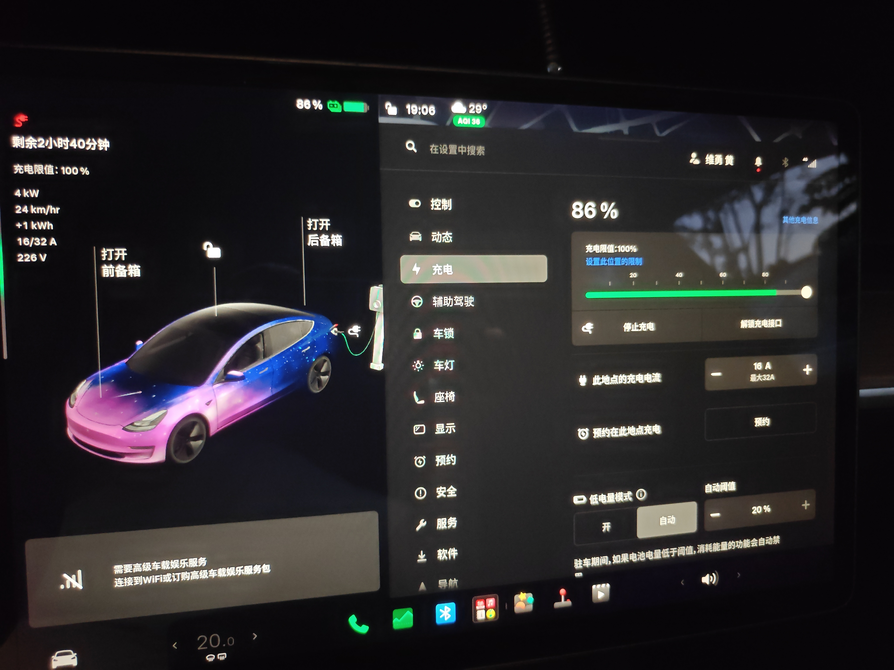

| Value ID | 名称 | AI识别值 | 单位 | 值位置 | 人工确认值 | 审核状态 | 审核备注 |
|---|---|---|---|---|---|---|---|
| E04-P03-V01 | 车辆充电状态 | 正在充电 |  | 车机充电页面左侧状态区 | 正在充电 | ACCEPTED |  |
| E04-P03-V02 | SOC | 86 | % | 车机页面顶部电池状态 | 86 | ACCEPTED |  |
| E04-P03-V03 | 车辆显示充电电压 | 226 | V | 车机充电页面左侧参数列 | 226 | ACCEPTED |  |
| E04-P03-V04 | 车辆实际充电电流 | 16 | A | 车机充电页面左侧参数列 | 16 | ACCEPTED |  |
| E04-P03-V05 | 车辆充电电流可用上限 | 32 | A | 车机充电页面左侧参数列 | 32 | ACCEPTED |  |
| E04-P03-V06 | 车辆显示充电功率 | 4 | kW | 车机充电页面左侧参数列 | 4 | ACCEPTED |  |
| E04-P03-V07 | 车辆充电电流设置 | 16 | A | 车机充电设置右侧调节栏 | 16 | ACCEPTED |  |

## Event E05：记录16安稳定响应

<!-- EVENT:E05 -->

- 实际时间：`2026-09-15T19:06:55.332+08:00`
- 状态：`triggered`

### Resource E05-P01（PHOTO）

<!-- RESOURCE:E05-P01 -->

- 文件：`photos/E05-P01_记录16安稳定响应_20260915_190710_677.jpg`
- 拍摄时间：`2026-09-15T19:07:10.677+08:00`
- 图片预览：

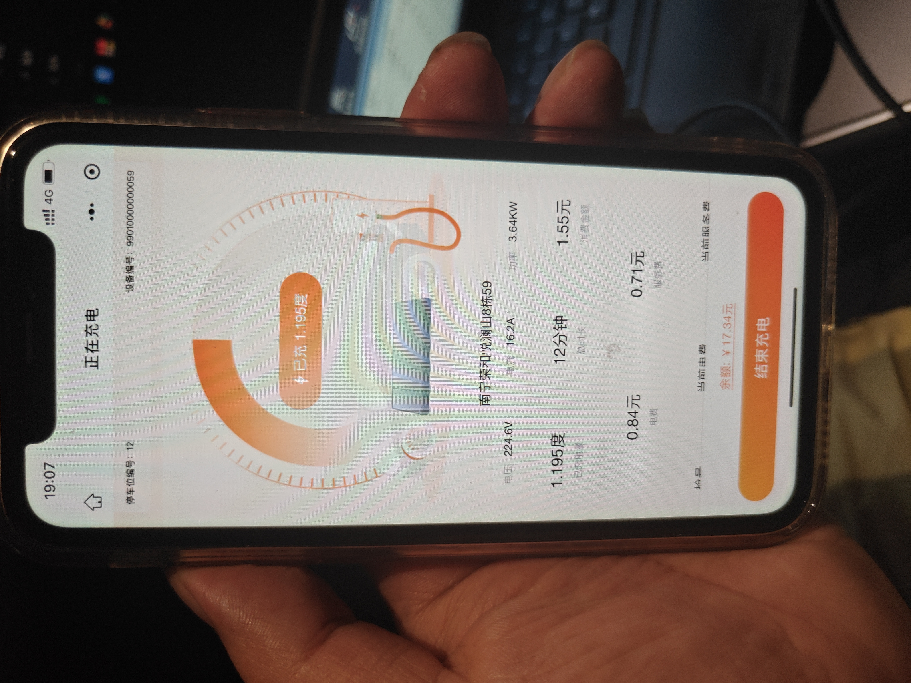

| Value ID | 名称 | AI识别值 | 单位 | 值位置 | 人工确认值 | 审核状态 | 审核备注 |
|---|---|---|---|---|---|---|---|
| E05-P01-V01 | 配套应用交流电压 | 224.6 | V | 手机页面参数行左侧 | 224.6 | ACCEPTED |  |
| E05-P01-V02 | 配套应用交流电流 | 16.2 | A | 手机页面参数行中部 | 16.2 | ACCEPTED |  |
| E05-P01-V03 | 配套应用充电功率 | 3.64 | kW | 手机页面参数行右侧 | 3.64 | ACCEPTED |  |
| E05-P01-V04 | 配套应用累计充电量 | 1.195 | kWh | 手机页面中下部 | 1.195 | ACCEPTED |  |

## Event E06：恢复到32安并记录

<!-- EVENT:E06 -->

- 实际时间：`2026-09-15T19:07:55.268+08:00`
- 状态：`triggered`

### Resource E06-P01（PHOTO）

<!-- RESOURCE:E06-P01 -->

- 文件：`photos/E06-P01_恢复到32安并记录_20260915_190808_583.jpg`
- 拍摄时间：`2026-09-15T19:08:08.583+08:00`
- 图片预览：

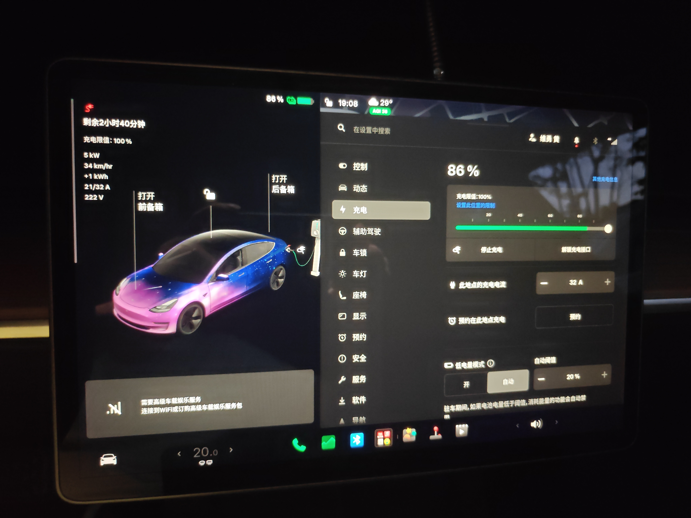

| Value ID | 名称 | AI识别值 | 单位 | 值位置 | 人工确认值 | 审核状态 | 审核备注 |
|---|---|---|---|---|---|---|---|
| E06-P01-V01 | 车辆充电状态 | 正在充电 |  | 车机充电页面左侧状态区 | 正在充电 | ACCEPTED |  |
| E06-P01-V02 | SOC | 86 | % | 车机页面顶部电池状态 | 86 | ACCEPTED |  |
| E06-P01-V03 | 车辆显示充电电压 | 222 | V | 车机充电页面左侧参数列 | 222 | ACCEPTED |  |
| E06-P01-V04 | 车辆实际充电电流 | 21 | A | 车机充电页面左侧参数列 | 21 | ACCEPTED | 恢复设置后的中间响应，不作为恢复稳定值 |
| E06-P01-V05 | 车辆充电电流可用上限 | 32 | A | 车机充电页面左侧参数列 | 32 | ACCEPTED |  |
| E06-P01-V06 | 车辆显示充电功率 | 5 | kW | 车机充电页面左侧参数列 | 5 | ACCEPTED |  |
| E06-P01-V07 | 车辆充电电流设置 | 32 | A | 车机充电设置右侧调节栏 | 32 | ACCEPTED |  |

### Resource E06-P02（PHOTO）

<!-- RESOURCE:E06-P02 -->

- 文件：`photos/E06-P02_恢复到32安并记录_20260915_190814_478.jpg`
- 拍摄时间：`2026-09-15T19:08:14.478+08:00`
- 图片预览：

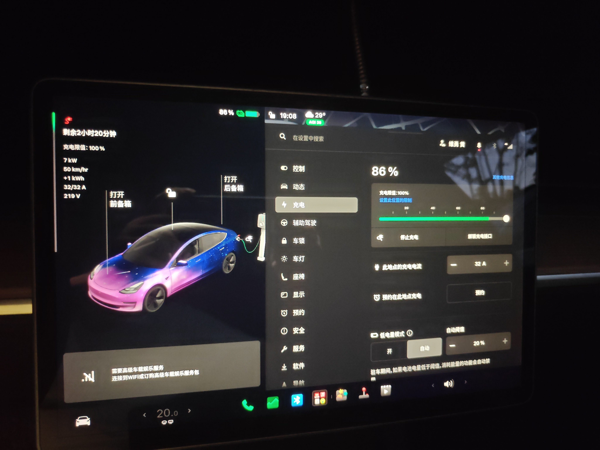

| Value ID | 名称 | AI识别值 | 单位 | 值位置 | 人工确认值 | 审核状态 | 审核备注 |
|---|---|---|---|---|---|---|---|
| E06-P02-V01 | 车辆充电状态 | 正在充电 |  | 车机充电页面左侧状态区 | 正在充电 | ACCEPTED |  |
| E06-P02-V02 | SOC | 86 | % | 车机页面顶部电池状态 | 86 | ACCEPTED |  |
| E06-P02-V03 | 车辆显示充电电压 | 219 | V | 车机充电页面左侧参数列 | 219 | ACCEPTED |  |
| E06-P02-V04 | 车辆实际充电电流 | 32 | A | 车机充电页面左侧参数列 | 32 | ACCEPTED |  |
| E06-P02-V05 | 车辆充电电流可用上限 | 32 | A | 车机充电页面左侧参数列 | 32 | ACCEPTED |  |
| E06-P02-V06 | 车辆显示充电功率 | 7 | kW | 车机充电页面左侧参数列 | 7 | ACCEPTED |  |
| E06-P02-V07 | 车辆充电电流设置 | 32 | A | 车机充电设置右侧调节栏 | 32 | ACCEPTED |  |

## Event E07：确认32安设置恢复

<!-- EVENT:E07 -->

- 实际时间：`2026-09-15T19:08:20.351+08:00`
- 状态：`triggered`

### Resource E07-P01（PHOTO）

<!-- RESOURCE:E07-P01 -->

- 文件：`photos/E07-P01_确认32安设置恢复_20260915_190826_128.jpg`
- 拍摄时间：`2026-09-15T19:08:26.128+08:00`
- 图片预览：

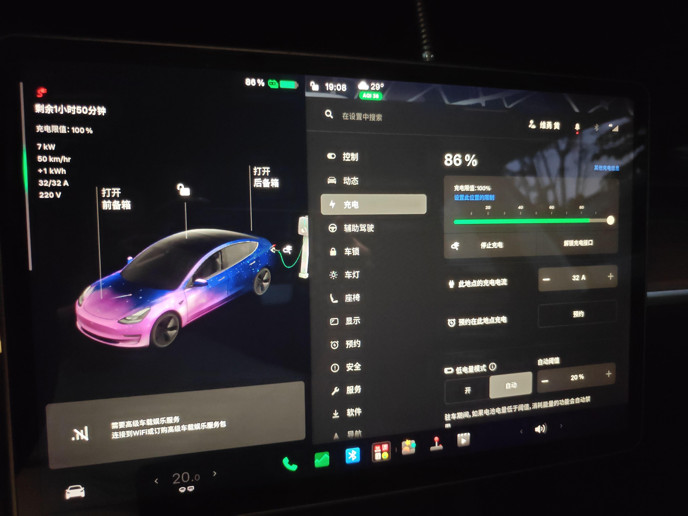

| Value ID | 名称 | AI识别值 | 单位 | 值位置 | 人工确认值 | 审核状态 | 审核备注 |
|---|---|---|---|---|---|---|---|
| E07-P01-V01 | 车辆充电状态 | 正在充电 |  | 车机充电页面左侧状态区 | 正在充电 | ACCEPTED |  |
| E07-P01-V02 | SOC | 86 | % | 车机页面顶部电池状态 | 86 | ACCEPTED |  |
| E07-P01-V03 | 车辆显示充电电压 | 220 | V | 车机充电页面左侧参数列 | 220 | ACCEPTED |  |
| E07-P01-V04 | 车辆实际充电电流 | 32 | A | 车机充电页面左侧参数列 | 32 | ACCEPTED |  |
| E07-P01-V05 | 车辆充电电流可用上限 | 32 | A | 车机充电页面左侧参数列 | 32 | ACCEPTED |  |
| E07-P01-V06 | 车辆显示充电功率 | 7 | kW | 车机充电页面左侧参数列 | 7 | ACCEPTED |  |
| E07-P01-V07 | 车辆充电电流设置 | 32 | A | 车机充电设置右侧调节栏 | 32 | ACCEPTED |  |

### Resource E07-P02（PHOTO）

<!-- RESOURCE:E07-P02 -->

- 文件：`photos/E07-P02_确认32安设置恢复_20260915_190834_008.jpg`
- 拍摄时间：`2026-09-15T19:08:34.008+08:00`
- 图片预览：

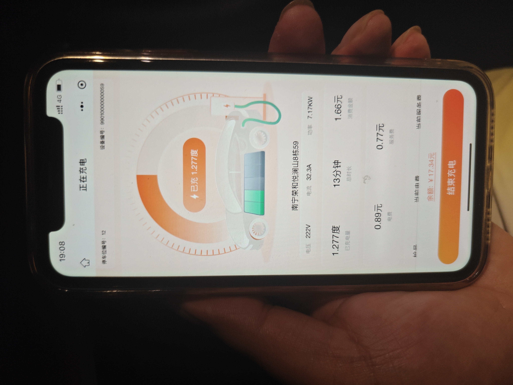

| Value ID | 名称 | AI识别值 | 单位 | 值位置 | 人工确认值 | 审核状态 | 审核备注 |
|---|---|---|---|---|---|---|---|
| E07-P02-V01 | 配套应用交流电压 | 222 | V | 手机页面参数行左侧 | 222 | ACCEPTED |  |
| E07-P02-V02 | 配套应用交流电流 | 32.3 | A | 手机页面参数行中部 | 32.3 | ACCEPTED |  |
| E07-P02-V03 | 配套应用充电功率 | 7.17 | kW | 手机页面参数行右侧 | 7.17 | ACCEPTED |  |
| E07-P02-V04 | 配套应用累计充电量 | 1.277 | kWh | 手机页面中下部 | 1.277 | ACCEPTED |  |

### Resource E07-P03（PHOTO）

<!-- RESOURCE:E07-P03 -->

- 文件：`photos/E07-P03_确认32安设置恢复_20260915_190906_099.jpg`
- 拍摄时间：`2026-09-15T19:09:06.099+08:00`
- 图片预览：

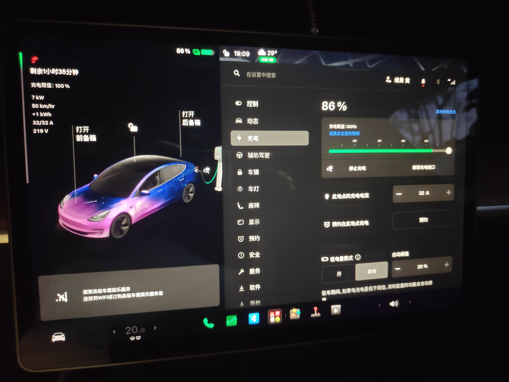

| Value ID | 名称 | AI识别值 | 单位 | 值位置 | 人工确认值 | 审核状态 | 审核备注 |
|---|---|---|---|---|---|---|---|
| E07-P03-V01 | 车辆充电状态 | 正在充电 |  | 车机充电页面左侧状态区 | 正在充电 | ACCEPTED |  |
| E07-P03-V02 | SOC | 86 | % | 车机页面顶部电池状态 | 86 | ACCEPTED |  |
| E07-P03-V03 | 车辆显示充电电压 | 219 | V | 车机充电页面左侧参数列 | 219 | ACCEPTED |  |
| E07-P03-V04 | 车辆实际充电电流 | 32 | A | 车机充电页面左侧参数列 | 32 | ACCEPTED |  |
| E07-P03-V05 | 车辆充电电流可用上限 | 32 | A | 车机充电页面左侧参数列 | 32 | ACCEPTED |  |
| E07-P03-V06 | 车辆显示充电功率 | 7 | kW | 车机充电页面左侧参数列 | 7 | ACCEPTED |  |
| E07-P03-V07 | 车辆充电电流设置 | 32 | A | 车机充电设置右侧调节栏 | 32 | ACCEPTED |  |

## Event E08：记录32安恢复响应

<!-- EVENT:E08 -->

- 实际时间：`2026-09-15T19:09:05.329+08:00`
- 状态：`triggered`

### Resource E08-P01（PHOTO）

<!-- RESOURCE:E08-P01 -->

- 文件：`photos/E08-P01_记录32安恢复响应_20260915_190915_253.jpg`
- 拍摄时间：`2026-09-15T19:09:15.253+08:00`
- 图片预览：

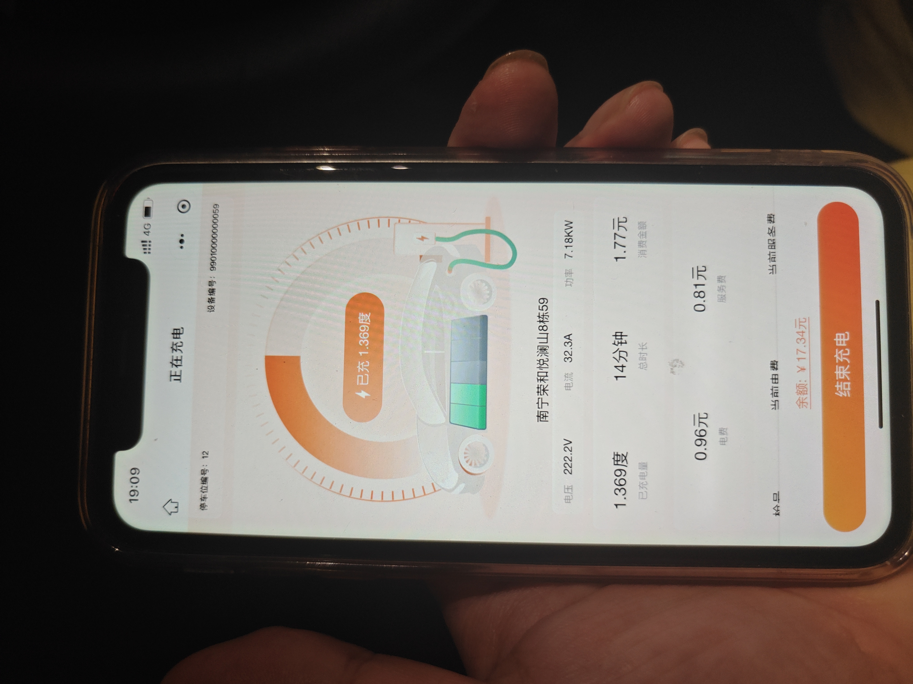

| Value ID | 名称 | AI识别值 | 单位 | 值位置 | 人工确认值 | 审核状态 | 审核备注 |
|---|---|---|---|---|---|---|---|
| E08-P01-V01 | 配套应用交流电压 | 222.2 | V | 手机页面参数行左侧 | 222.2 | ACCEPTED |  |
| E08-P01-V02 | 配套应用交流电流 | 32.3 | A | 手机页面参数行中部 | 32.3 | ACCEPTED |  |
| E08-P01-V03 | 配套应用充电功率 | 7.18 | kW | 手机页面参数行右侧 | 7.18 | ACCEPTED |  |
| E08-P01-V04 | 配套应用累计充电量 | 1.369 | kWh | 手机页面中下部 | 1.369 | ACCEPTED |  |

## Event E09：检查证据并结束采集

<!-- EVENT:E09 -->

- 实际时间：`2026-09-15T19:10:05.286+08:00`
- 状态：`triggered`
